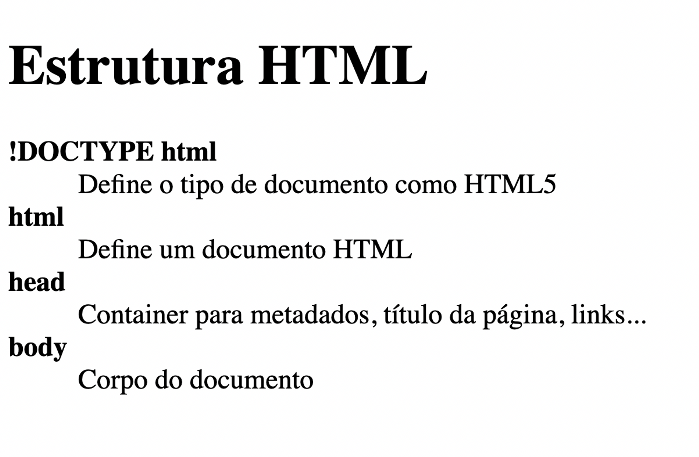

<h1 align="center">Glossario</>

Programa exclusivo e gratuito, promovido pela Rocketseat para ensino de tecnologias WEB.

  <a href="#-tecnologias">Tecnologias </a>&nbsp;&nbsp;&nbsp;|&nbsp;&nbsp;&nbsp;
  <a href="#-projeto">Projeto </a>&nbsp;&nbsp;&nbsp;|&nbsp;&nbsp;&nbsp;
 
  <a href="#memo-licença">Licença</a>&nbsp;&nbsp;&nbsp;|&nbsp;&nbsp;&nbsp;

  

 

  

## 🚀Tecnologias

Esse projeto foi desenvolvido com a seguinte tecnologia:

- HTML 

## 💻Projeto

Um glossario bem basico em HTML que no qual dentro da plataforma da [ROCKETSEAT](https://rocketseat.com) disponibiliza alguns desafios que começam do basico até o avançado. 

## :memo: Licença

Esse projeto está sob a licença MIT.

---

Feito com ❤ by Bruno Dias :wave: [Acesse meu LinkedIn!](https://www.linkedin.com/in/bruno-dias-custodio-50461b259/)